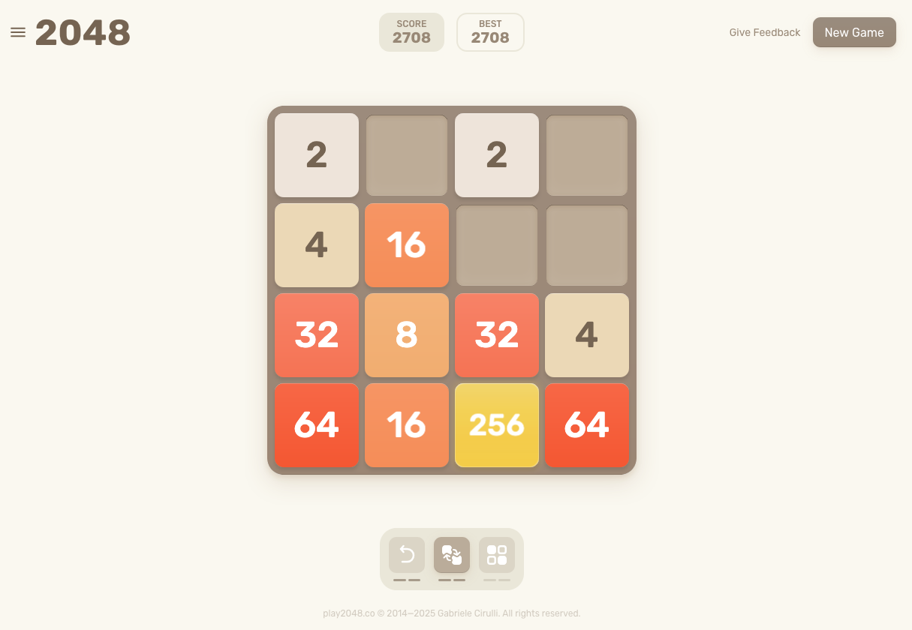

::image::

::bottom::

### [Clicca qui](https://play2048.co/) per giocare o scarica l'app col QR Code
<HSpace space="6"/>
<LightOrDark>
  <template #light>
        <QRCode
            :width="100"
            :height="100"
            type="svg"
            data="https://play.google.com/store/apps/details?id=com.gabrielecirulli.app2048"
            image="https://upload.wikimedia.org/wikipedia/commons/thumb/2/2f/Google_Play_2022_icon.svg/500px-Google_Play_2022_icon.svg.png"
            :imageOptions="{ crossOrigin: 'anonymous', margin: 4}"
            :dotsOptions="{ type: 'extra-rounded', color: 'black' }"
        />
        <QRCode
            :width="100"
            :height="100"
            type="svg"
            data="https://apps.apple.com/us/app/2048-by-gabriele-cirulli/id868076805"
            image="https://upload.wikimedia.org/wikipedia/commons/thumb/6/67/App_Store_%28iOS%29.svg/250px-App_Store_%28iOS%29.svg.png"
            :imageOptions="{ crossOrigin: 'anonymous', margin: 4}"
            :dotsOptions="{ type: 'extra-rounded', color: 'black' }"
        />
    </template>
    <template #dark>
            <QRCode
            :width="100"
            :height="100"
            type="svg"
            data="https://play.google.com/store/apps/details?id=com.gabrielecirulli.app2048"
            image="https://upload.wikimedia.org/wikipedia/commons/thumb/2/2f/Google_Play_2022_icon.svg/500px-Google_Play_2022_icon.svg.png"
            :imageOptions="{ crossOrigin: 'anonymous', margin: 4}"
            :dotsOptions="{ type: 'extra-rounded', color: 'white' }"
        />
        <QRCode
            :width="100"
            :height="100"
            type="svg"
            data="https://apps.apple.com/us/app/2048-by-gabriele-cirulli/id868076805"
            image="https://upload.wikimedia.org/wikipedia/commons/thumb/6/67/App_Store_%28iOS%29.svg/250px-App_Store_%28iOS%29.svg.png"
            :imageOptions="{ crossOrigin: 'anonymous', margin: 4}"
            :dotsOptions="{ type: 'extra-rounded', color: 'white' }"
        />
    </template>
</LightOrDark>

