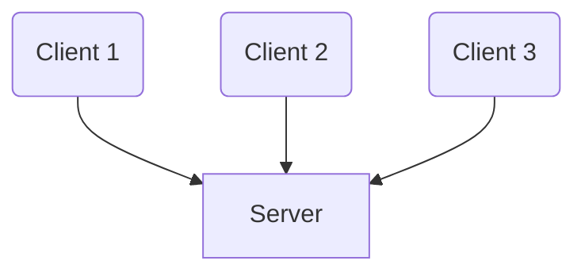

::left::
### È il modello più comune.

- ### **Server**: Un processo <Alert>potente</Alert> che offre una risorsa o un servizio. È sempre in attesa di richieste
- ### **Client**: Un processo che <Alert>inizia la comunicazione</Alert> richiedendo il servizio al server

<NoteBlock class="mt-4">

### La comunicazione è <Alert strong>centralizzata</Alert>. Se il server va offline, il servizio non è più disponibile

</NoteBlock>

::right::

