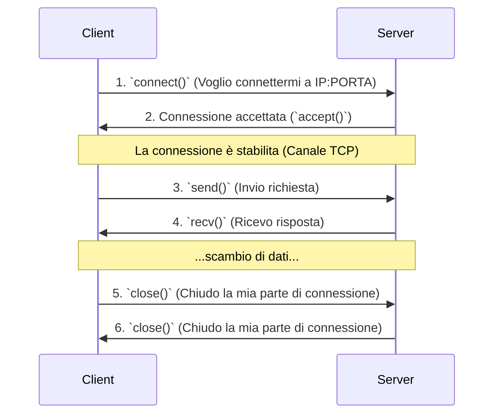

```mermaid
sequenceDiagram
    participant Client
    participant Server
    Client->>Server: 1. `connect()` (Voglio connettermi a IP:PORTA)
    Server->>Client: 2. Connessione accettata (`accept()`)
    Note over Client,Server: La connessione è stabilita (Canale TCP)
    Client->>Server: 3. `send()` (Invio richiesta)
    Server->>Client: 4. `recv()` (Ricevo risposta)
    Note over Client,Server: ...scambio di dati...
    Client->>Server: 5. `close()` (Chiudo la mia parte di connessione)
    Server->>Client: 6. `close()` (Chiudo la mia parte di connessione)
```

