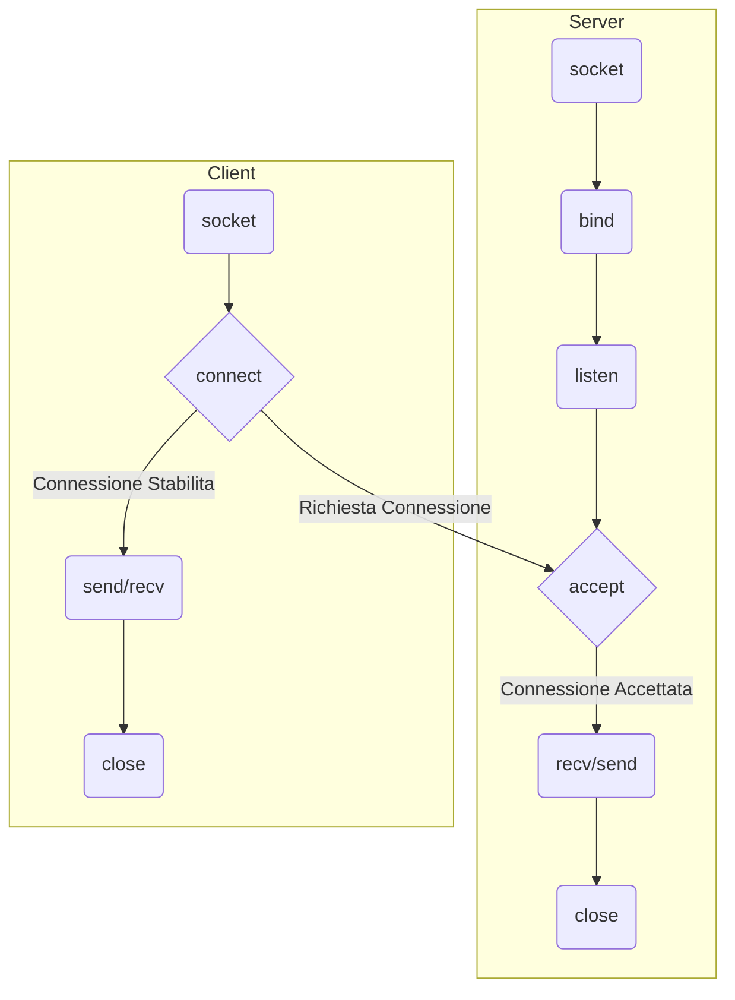

```mermaid
graph TD
    subgraph Server
        A(socket) --> B(bind)
        B --> C(listen)
        C --> D{accept}
        D -- Connessione Accettata --> E(recv/send)
        E --> F(close)
    end
    subgraph Client
        G(socket) --> H{connect}
        H -- Richiesta Connessione --> D
        H -- Connessione Stabilita --> I(send/recv)
        I --> J(close)
    end
```
