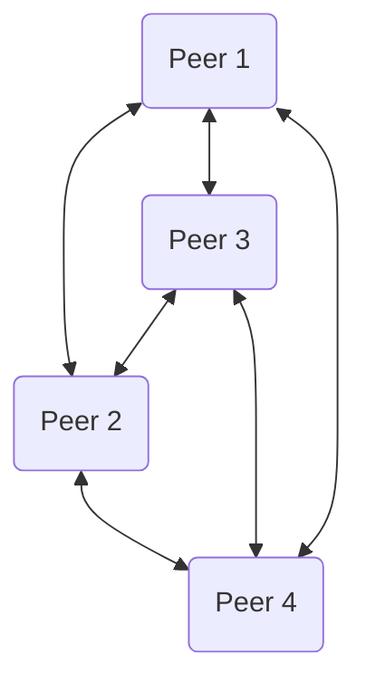

::left::
### Tutti i nodi sono "pari" (peer).

- ### Ogni nodo può agire sia da <Alert>Client</Alert> che da <Alert>Server</Alert>
- ### I peer comunicano direttamente tra loro, senza un intermediario centrale

<NoteBlock>

### Questo modello è <Alert strong>decentralizzato</Alert>, molto robusto e scalabile. Pensate ai sistemi di file sharing come BitTorrent

</NoteBlock>

::right::

