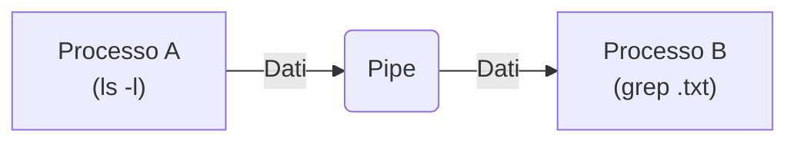

::left::

<DefinitionBlock class="mb-8">

### Una <Alert strong>pipe</Alert> è un <Alert>canale di comunicazione unidirezionale</Alert>. Un processo scrive dati a un'estremità e un altro processo li legge dall'altra estremità

</DefinitionBlock>

### Uno dei primi meccanismi di IPC, introdotto in **Unix**

::right::

<ExampleBlock class="mb-4">

### Il comando `ls -l | grep .txt` usa una pipe. L'output di `ls -l` viene "infilato" nella pipe e diventa l'input per il comando `grep`

</ExampleBlock>

