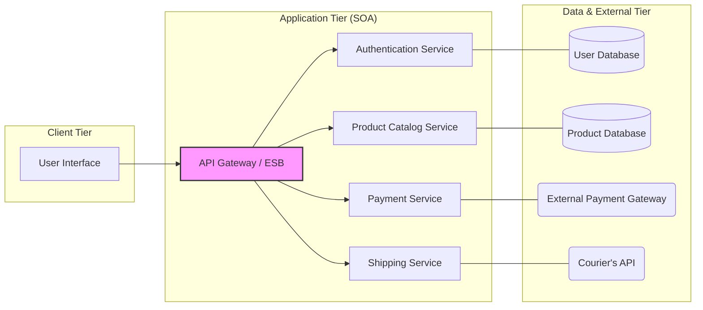

## Immaginiamo un sito di e-commerce

<VSpace space="4"/>

```mermaid
graph LR
    subgraph "Client Tier"
        UI[User Interface]
    end

    subgraph "Application Tier (SOA)"
        UI --> GW[API Gateway / ESB]

        GW --> AS[Authentication Service]
        GW --> CS[Product Catalog Service]
        GW --> PS[Payment Service]
        GW --> SS[Shipping Service]
    end

    subgraph "Data & External Tier"
        AS --- DB_Users[(User Database)]
        CS --- DB_Products[(Product Database)]
        PS --- Payment_Gateway(External Payment Gateway)
        SS --- Courier_API(Courier's API)
    end

    style GW fill:#f9f,stroke:#333,stroke-width:2px
```
