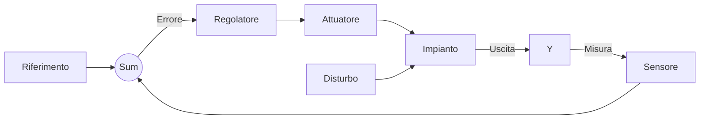

<DefinitionBlock class="mb-8">

### In un sistema a <Alert strong>catena chiusa</Alert> (o retroazionato), l'azione di controllo dipende dalla **differenza** tra il valore desiderato (riferimento) e il valore di uscita <Alert>effettivamente misurato</Alert>

</DefinitionBlock>

