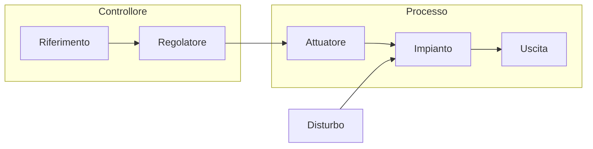

<DefinitionBlock>

### In un sistema a <Alert strong>catena aperta</Alert>, l'azione di controllo è **indipendente** dall'uscita del sistema.
### Il sistema non "controlla" il risultato della propria azione

</DefinitionBlock>

<VSpace space="4"/>

