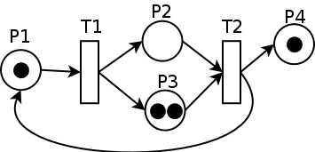

::tl::
### <Alert strong>Equazioni Differenziali</Alert>

<VSpace space="4"/>

### $m\frac{d^2x(t)}{dt^2} + \beta\frac{dx(t)}{dt} + kx(t) = F(t)$

::tr::
### <Alert strong>Diagrammi a Blocchi</Alert>

<VSpace space="4"/>

::bl::
### <Alert strong>Automi a Stati Finiti</Alert>

<VSpace space="4"/>

::br::
### <Alert strong>Reti di Petri</Alert>

<VSpace space="4"/>

