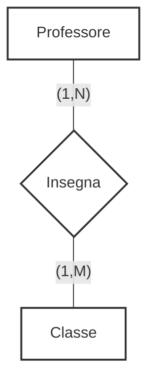

::left::
### **Relazione N:M** (molti a molti)
### Ad una istanza della prima entità possono corrispondere <Alert>molte</Alert> istanze della seconda, e viceversa

<ExampleBlock class="mt-4">

### Un **Professore** *insegna* in più **Classi**.
(Un professore insegna in tante classi e una classe ha tanti professori)

</ExampleBlock>

::right::

