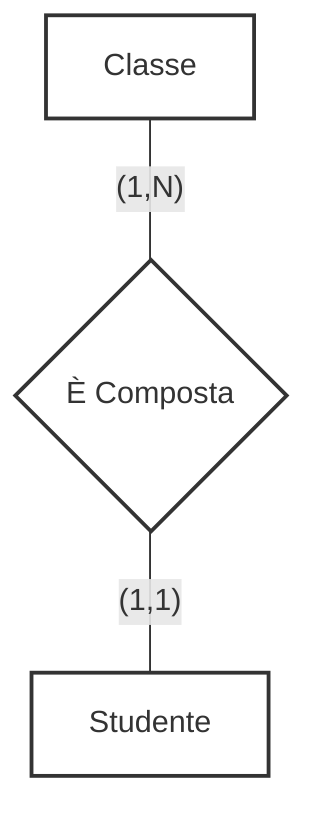

::left::
### **Relazione 1:N** (uno a molti)
### Ad una istanza della prima entità possono corrispondere <Alert>molte</Alert> istanze della seconda. Ad una istanza della seconda corrisponde <Alert>una sola</Alert> istanza della prima

<ExampleBlock class="mt-4">

### Una **Classe** *è composta* da tanti **Studenti**
(una classe può avere tanti studenti, ma uno studente fa parte di una sola classe)

</ExampleBlock>

::right::

