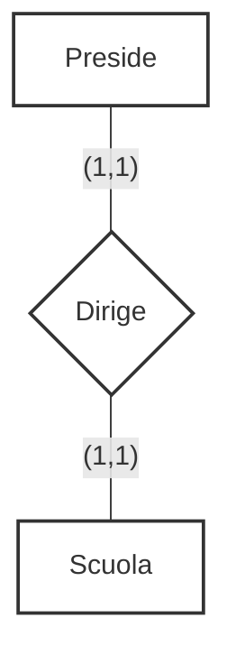

::left::
### **Relazione 1:1**
### Ad una istanza della prima entità corrisponde <Alert>al massimo una</Alert> istanza della seconda, e viceversa

<ExampleBlock class="mt-4">

### Un **Preside** dirige una **Scuola**.
(Ogni preside dirige una sola scuola, ogni scuola è diretta da un solo preside)

</ExampleBlock>

::right::

