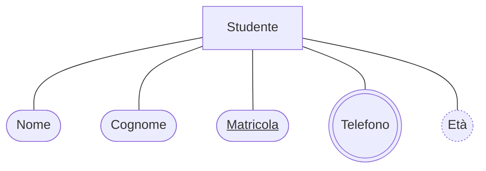

### Nello schema E-R, gli attributi si rappresentano con un'<Alert strong>ellisse</Alert> collegata all'entità

- ### La <Alert>chiave primaria</Alert> ha il nome <Alert>sottolineato</Alert>
- ### Gli attributi <Alert>multivalore</Alert> sono cerchiati da una <Alert>doppia ellisse</Alert>
- ### Gli attributi <Alert>derivati</Alert> sono rappresentati da un'<Alert>ellisse tratteggiata</Alert>

<VSpace space="4"/>

