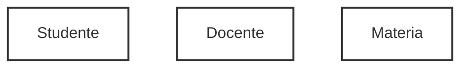

## Nello schema E-R, le entità si rappresentano con un <Alert strong>rettangolo</Alert> che contiene il nome dell'entità

<VSpace space="16"/>

```mermaid
graph TD
    A[Studente]
    B[Docente]
    C[Materia]

    style A fill:#fff,stroke:#333,stroke-width:2px
    style B fill:#fff,stroke:#333,stroke-width:2px
    style C fill:#fff,stroke:#333,stroke-width:2px
```
