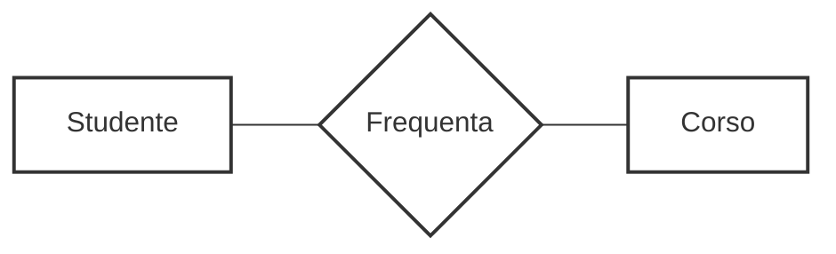

## Nello schema E-R, le relazioni si rappresentano con un <Alert strong>rombo</Alert>, collegato alle entità che partecipano alla relazione

<VSpace space="16"/>

```mermaid
graph LR
    A[Studente]
    B{Frequenta}
    C[Corso]
    A---B---C

    style A fill:#fff,stroke:#333,stroke-width:2px
    style C fill:#fff,stroke:#333,stroke-width:2px
    style B fill:#fff,stroke:#333,stroke-width:2px
```
