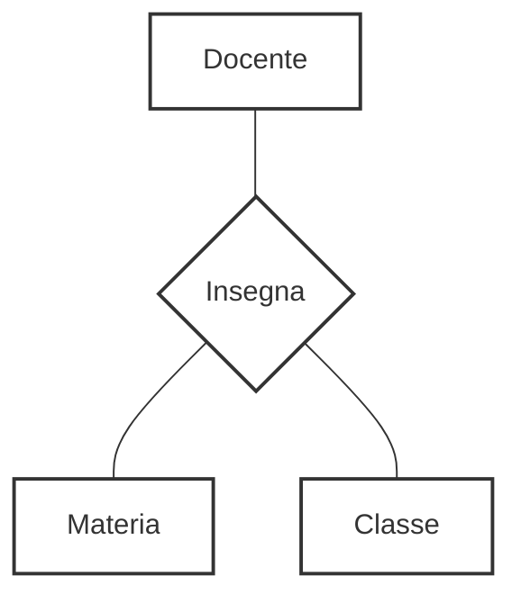

::left::

<ExampleBlock>

### Immaginiamo di voler registrare quale **Docente** insegna una certa **Materia** in una specifica **Classe**.

<VSpace space="2"/>

### Se dicessimo solo "Rossi insegna Matematica" e "Rossi insegna nella 5A", non sapremmo se nella 5A insegna Matematica o magari Fisica

</ExampleBlock>

::right::

