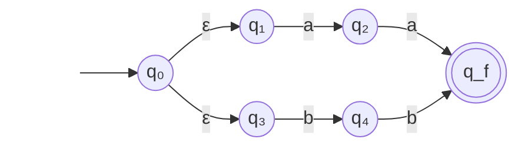

### Le transizioni **ε** permettono di unire automi più semplici.

### **Obiettivo**: Accettare stringhe che sono "**aa**" oppure "**bb**"

<ExampleBlock v-click class="my-4">

</ExampleBlock>

<v-click>

### Da $q₀$, l'automa si sposta "gratuitamente" e simultaneamente in $q₁$ e $q₃$ per iniziare a controllare entrambi i pattern

</v-click>
