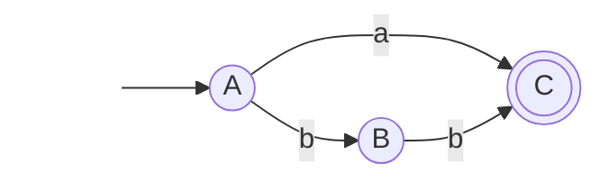

::top::
### Gli automi vengono spesso rappresentati con i <Alert strong>diagrammi di stato</Alert>

<VSpace space="4"/>

::left::
## <Alert strong>Stati</Alert>
### Rappresentati da cerchi. Lo stato iniziale ha una freccia entrante "dal nulla"

::center::
## <Alert strong>Transizioni</Alert>
### Rappresentate da frecce da uno stato all'altro, etichettate con il simbolo di input che le causa

::right::
## <Alert strong>Stati Finali</Alert>
### Rappresentati da un doppio cerchio. Sono gli stati di "successo"
