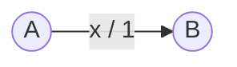

## In una Macchina di Mealy, l'output non è scritto nello stato, ma <Alert>sulla transizione</Alert>

<VSpace space="8"/>

## L'output viene generato **durante il passaggio** da uno stato all'altro. Dipende quindi sia da dove partiamo (stato) sia dalla strada che prendiamo (input)

<VSpace space="8"/>

