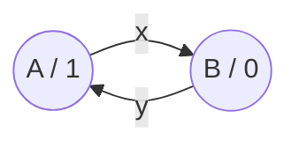

### In una Macchina di Moore, ogni stato ha una label con scritto l'output che produce

<VSpace space="4"/>

### Quando l'automa <Alert>entra in uno stato</Alert>, genera immediatamente il simbolo di output associato a quello stato, indipendentemente da come ci è arrivato.

<VSpace space="16"/>

