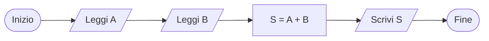

```mermaid
graph LR
    A([Inizio]) --> B[/Leggi A/];
    B --> C[/Leggi B/];
    C --> D["S = A + B"];
    D --> E[/Scrivi S/];
    E --> F([Fine]);
```

<NoteBlock class="mt-8">
Osservate come la sequenza dei blocchi segue esattamente i passi che abbiamo definito. Questo è un esempio di <Alert strong>struttura di sequenza</Alert>.
</NoteBlock>
