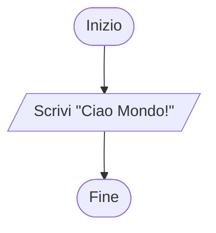

::left::

- ## <Alert>Inizio</Alert>: Partiamo con   il blocco ovale <VSpace space="6"/>

- ## <Alert>Output</Alert>: Usiamo il parallelogramma per l'operazione di scrittura <VSpace space="6"/>

- ## <Alert>Fine</Alert>: Concludiamo con un altro blocco ovale

::right::

