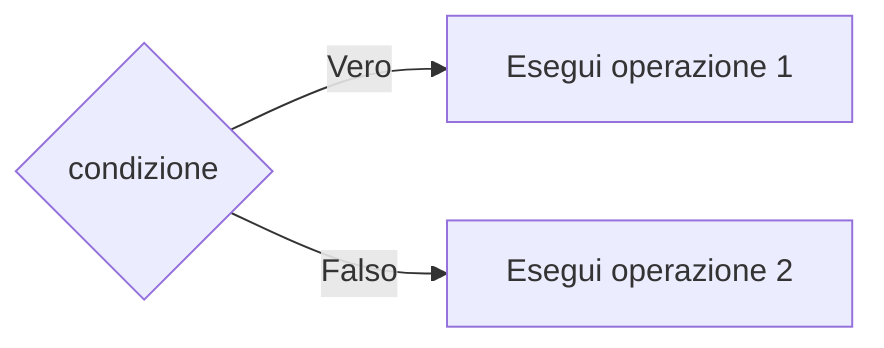

<DefinitionBlock class="mb-4">

Rappresenta un <Alert strong>bivio</Alert> nell'algoritmo. Pone una domanda la cui risposta può essere solo <Alert>VERO</Alert> o <Alert>FALSO</Alert>.

</DefinitionBlock>

<NoteBlock>
Dal blocco a rombo escono sempre <Alert strong>due</Alert> frecce, etichettate con "Vero" (o "Sì") e "Falso" (o "No").
</NoteBlock>
