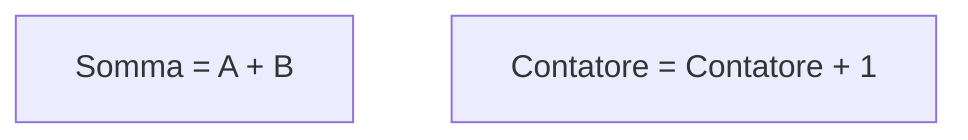

<DefinitionBlock class="mb-8">

## Indica un'<Alert strong>operazione</Alert>, un calcolo, un'assegnazione di un valore a una variabile

</DefinitionBlock>

<ExampleBlock class="mt-8">

### Calcolare l'area di un quadrato

### Sommare due numeri

</ExampleBlock>
