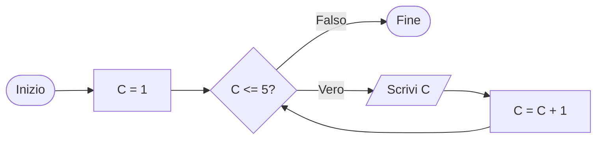

<WarningBlock v-click>

### L'istruzione C = C + 1 è <Alert strong>fondamentale</Alert>! Senza di essa, la condizione C <= 5 sarebbe sempre vera e il ciclo non finirebbe mai (loop infinito).

</WarningBlock>
