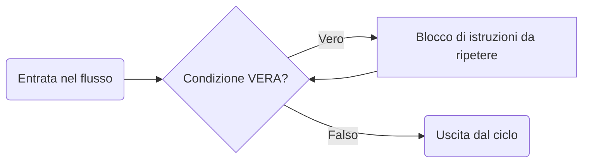

<VSpace space="4"/>

<TakeawayBlock v-click class="mt-4">

### La freccia che dal rettangolo torna al rombo è quella che crea il <Alert strong>loop</Alert>. L'esecuzione rimane "intrappolata" in questo percorso finché la condizione non diventa falsa

</TakeawayBlock>
