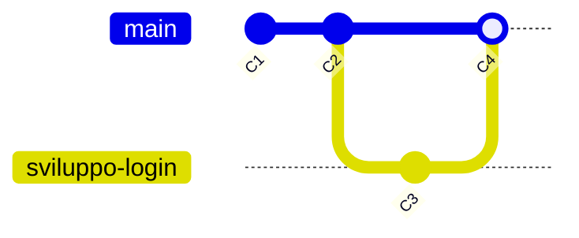

::top::
Immagina un branch come una **linea temporale parallela** del tuo progetto.

La linea principale si chiama `main` (o `master`) e dovrebbe contenere solo codice stabile e funzionante.

::left::

<Alert strong>Workflow tipico:</Alert>
1.  Crea un branch `sviluppo-login`.
2.  Lavora e fai commit su questo branch.
3.  Quando hai finito e tutto funziona, unisci le tue modifiche al `main`.

::right::
<v-after>

</v-after>

::bottom::
<v-click>

Questo permette di mantenere il `main` sempre pulito e di lavorare su più cose contemporaneamente senza creare conflitti.

</v-click>

