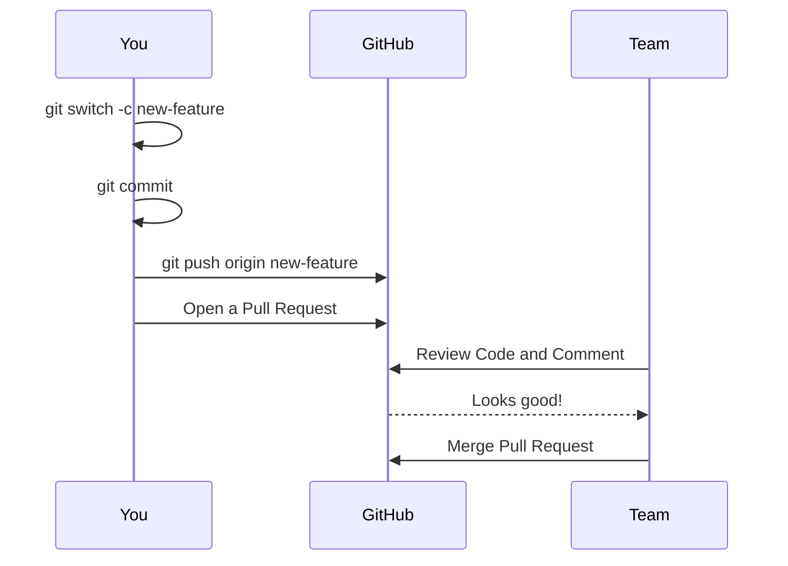

::top::
### Quando si collabora su GitHub, non si invia il codice direttamente al branch main. Le modifiche vengono proposte tramite una Pull Request (PR)

::right::

::left::

#### <Alert strong>Shared Repository Model</Alert>

#### Tutti coloro con accesso in scrittura lavorano su branch all'interno dello stesso repository centrale

<VSpace space="6"/>

#### <Alert strong>Fork & Pull Model</Alert>

#### Crei una copia personale lato server (<Alert>fork</Alert>) del progetto. Invii le modifiche al tuo fork e poi apri una PR dal tuo fork al progetto originale.

